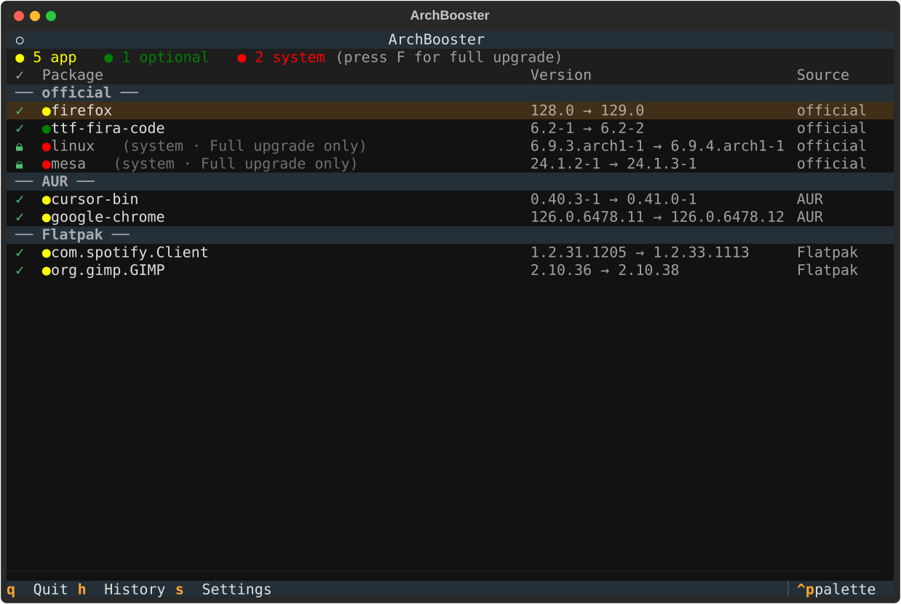

# ⚡ ArchBooster

**Update your apps, leave the OS alone.**

A selective update manager for Linux, built with Python + Textual. ArchBooster
gives you one unified, checkbox-driven view across every package source on
your machine — official repos, AUR, Flatpak, apt, dnf, Snap, and Homebrew —
categorizes updates by risk, and refuses to let a partial system upgrade slip
through by accident.

Runs on **Arch (+ Arch-based) via pacman/AUR, Debian/Ubuntu via apt,
Fedora/RHEL via dnf, and any distro with Flatpak, Snap, or Homebrew.**

---

## Why this, when `flatpak update` and `yay -Sua` already exist?

Each package manager already has its own "update everything" command. What
none of them gives you:

- **One list across all of them.** pacman, AUR, and Flatpak updates in a
  single screen instead of three terminals.
- **One command that never touches your system layer.** `archbooster
  --update` (or `[ENTER]` in the TUI) updates your apps — and the libraries
  they need — while the kernel, drivers, firmware, and bootloader are
  **always held back** via pacman's own `--ignore` mechanism. Updating the
  system layer takes an explicit full upgrade, with a snapshot taken first.
- **A safety guardrail.** ArchBooster knows the difference between an
  **app** (Firefox, a Flatpak, an AUR `-bin` package) and the **system**
  (kernel, mesa/nvidia drivers, glibc, systemd). A *partial* upgrade of the
  system layer is exactly how a rolling-release install breaks, so system
  packages can never be cherry-picked — they only move together, via a full
  `-Syu`.
- **Categorization, filters, history, and a background check** — packages
  are sorted into user vocabulary (Apps / CLI & libraries / Drivers &
  firmware / Kernel / Core system / Fonts & themes) and filterable by type
  and by package manager; every run is logged, and a systemd timer can check
  on a schedule and notify you without auto-updating anything.

That combination — unification + the app/system guardrail — is the thing no
single command does.

---

## Features

- Unified scan across **pacman + AUR (yay/paru), Flatpak, apt, dnf, Snap, and
  Homebrew**, grouped by source
- **Apps-first one-command update** (`archbooster --update` / `[ENTER]`):
  updates the app layer via `-Syu --ignore=<system packages>` — a coherent
  sync in which libraries ride along, but kernel/drivers/firmware/bootloader
  are always held back
- **Type & source filters** (`TAB` / `M`) — Apps, CLI & libraries, Drivers &
  firmware, Kernel, Core system, Fonts & themes; or a single package manager.
  User-facing apps are detected by their `.desktop` launchers (Flatpak/Snap
  count automatically)
- **Never a blank list** — up-to-date packages are shown too, in the TUI and
  in `--scan`, so "no updates" reads as a healthy inventory instead of an
  empty screen
- 🔴 Critical / 🟡 Normal / 🟢 Optional categorization (configurable overrides,
  with distro-specific system-package lists for apt/dnf too)
- Select individual packages to update — never forced, system packages held
- Live streaming output during update (real pacman/yay/flatpak/apt/dnf output)
- **Changelog / PKGBUILD diff viewer** (`C`) — see what actually changed in an
  AUR package (PKGBUILD diff) or a Flatpak (OSTree commit log) before updating
- **Snapshot + rollback** — a full system upgrade (`F`) takes a snapper/
  timeshift snapshot first when one's installed; roll back anytime from the
  Snapshots screen (`B`)
- **Update profiles** (`P`) — cycle named groups of packages (e.g. "browsers")
  from config, auto-selecting just that group; also drives opt-in scheduled
  auto-update of a chosen safe subset (system packages always excluded)
- Update history log
- Background daemon via systemd timer (checks every N hours) with a desktop
  notification (`notify-send`) when updates are found
- Graceful degrade: a backend that isn't installed just reports itself
  unavailable, so e.g. a Fedora box with only Flatpak gets a clean
  Flatpak-only list instead of a misleading empty one

---

## Requirements

- Python 3.11+
- At least one supported backend:
  - **Arch / Arch-based**: `pacman-contrib` (for `checkupdates`) and
    `yay` or `paru` for AUR — `sudo pacman -S pacman-contrib`
  - **Debian / Ubuntu**: `apt` (present by default)
  - **Fedora / RHEL**: `dnf` (present by default)
  - **Any distro**: `flatpak`, with at least one remote added (e.g. Flathub)
  - **Any distro**: `snap` (snapd)
  - **Any distro**: `brew` (Homebrew/Linuxbrew)
- Optional: `notify-send` (`libnotify`) for desktop notifications from the
  background daemon — installed by default on almost every desktop distro
- Optional: `snapper` or `timeshift` for pre-upgrade snapshots + rollback
- Optional: `systemd` user services, for the background timer

---

## Install

Three ways to get it, pick whichever fits:

| Method | Command | Best for |
|---|---|---|
| **pipx** (PyPI) | `pipx install archbooster` | Any distro with Python 3.11+ |
| **Static binary** | Download `archbooster-linux-x86_64` from [Releases](https://github.com/ansu555/archbooster/releases) | Zero-Python install, quick try |
| **AUR** | `yay -S archbooster` *(source)* or `archbooster-bin` *(prebuilt)* | Arch / Arch-based — **pending**, see note below |

```bash
# pipx (recommended)
pipx install archbooster

# from source, with the bundled installer (also sets up the systemd timer)
git clone https://github.com/ansu555/archbooster
cd archbooster
bash install.sh

# static binary
curl -LO https://github.com/ansu555/archbooster/releases/latest/download/archbooster-linux-x86_64
chmod +x archbooster-linux-x86_64
./archbooster-linux-x86_64
```

> Installing pipx first, if needed: `sudo pacman -S python-pipx` /
> `sudo apt install pipx` / `sudo dnf install pipx`.

> **AUR note:** the `PKGBUILD`s are ready in `packaging/aur/`, but new-account
> registration on `aur.archlinux.org` is currently closed on Arch's side, so
> the packages aren't pushed yet. Use pipx or the binary until that reopens.

---

## Usage

| Command                    | Action                              |
|-----------------------------|--------------------------------------|
| `archbooster`               | Open the full TUI dashboard         |
| `archbooster --update`      | **The one command**: update the app layer now; system layer always held back |
| `archbooster --update --scope apps` | Same, but user-facing apps only (default scope is `safe`; see config) |
| `archbooster --scan`        | Print pending updates + inventory summary (never blank) |
| `archbooster --scan --all`  | Also list every up-to-date package  |
| `archbooster --daemon`      | Run one background check (systemd)  |

### Keybindings (inside TUI)

| Key      | Action                        |
|----------|-------------------------------|
| `A`      | Select all packages           |
| `N`      | Deselect all                  |
| `I`      | Invert selection               |
| `U`      | Select user-facing apps only  |
| `TAB`    | Cycle type filter (Apps / CLI / Drivers / Kernel / System / Fonts) |
| `M`      | Cycle source filter (pacman / AUR / Flatpak / …) |
| `Enter`  | Update selected (app layer; system always held back) |
| `F`      | Full system upgrade (snapshot first, if enabled) |
| `R`      | Re-scan for updates           |
| `C`      | Changelog / PKGBUILD diff for the highlighted row |
| `P`      | Cycle update profiles (see `[profiles]` in config) |
| `H`      | Open history                  |
| `S`      | Open settings                 |
| `B`      | Open snapshots (rollback: `R` to arm, `Y` to confirm) |
| `Q`      | Quit                          |



---

## Config

Auto-created at `~/.config/archbooster/config.toml` on first run:

```toml
[general]
aur_helper     = "yay"   # or "paru"
check_interval = 4       # hours between background daemon scans
confirm        = false   # false: run pacman/yay/flatpak non-interactively
                          #        (your selection in the TUI is the
                          #        confirmation).
                          # true:  also show the package manager's own
                          #        prompts (best from a plain terminal).
notify         = true    # desktop notification (notify-send) when the
                          # background daemon finds updates. No-ops quietly
                          # if notify-send isn't installed.

[categories]
extra_critical = []      # extra package name prefixes to force "critical"
extra_optional = []      # extra package name prefixes to force "optional"

[ignore]
packages = []            # packages to hide from the update list entirely

[update]
default_scope = "safe"   # scope of `archbooster --update` / [ENTER]:
                          # "safe" = everything except the system layer
                          #          (libraries ride along — recommended)
                          # "apps" = user-facing apps only

[snapshot]
enabled = true           # snapshot (snapper/timeshift) before a full upgrade
backend = "auto"          # "auto" | "snapper" | "timeshift" | "none"

[profiles]
# named package-name pattern groups for the [P] filter, e.g.:
# browsers = ["firefox", "chromium", "*chrome*"]

[automation]
auto_update         = false  # opt-in: daemon auto-updates auto_update_profile
auto_update_profile = ""     # name of a [profiles] entry
```

See [`docs/config.md`](docs/config.md) for a field-by-field reference.

---

## Project Structure

```
archbooster/
├── main.py                     # Entry point + CLI flags
├── app.py                      # Textual app root + screen router
├── daemon.py                   # Background check loop (systemd) + notify
├── core/
│   ├── scanner.py              # Package dataclass + line parsing
│   ├── categorizer.py          # critical / normal / optional + guardrail
│   │                           #   (per-distro pattern lists: Arch/apt/dnf)
│   ├── updater.py               # runs yay/pacman, streams output
│   ├── procutil.py              # shared subprocess-streaming helper
│   ├── notify.py                # notify-send wrapper
│   ├── history.py               # read/write history.json
│   ├── config.py                # load/write config.toml
│   ├── snapshot.py               # snapper/timeshift snapshot + rollback
│   ├── profiles.py               # [profiles] pattern matching
│   └── backends/
│       ├── base.py              # Backend interface
│       ├── pacman.py            # official repos + AUR (+ PKGBUILD diff)
│       ├── flatpak.py           # Flatpak — the cross-distro path
│       ├── apt.py                # Debian/Ubuntu
│       ├── dnf.py                # Fedora/RHEL
│       ├── snap.py                # snapd
│       ├── brew.py                # Homebrew/Linuxbrew
│       └── registry.py          # auto-detects installed backends
├── screens/
│   ├── dashboard.py             # Main checklist UI, grouped by source
│   ├── progress.py              # Live update output (+ pre-upgrade snapshot)
│   ├── changelog.py              # Changelog / PKGBUILD diff viewer
│   ├── snapshots.py               # Snapshot list + rollback
│   ├── history.py                # Past updates log
│   └── settings.py               # Settings editor
├── systemd/
│   ├── archbooster.service       # Systemd user service
│   └── archbooster.timer         # Systemd timer (every N hours)
├── packaging/                    # PyInstaller binary + AUR PKGBUILDs
└── install.sh                    # One-shot pipx-based installer
```

---

## Roadmap

- [x] Phase 0 — Release hardening (license, pipx installer, config-driven
      confirm, tests + CI)
- [x] Phase 2 — Full Textual dashboard + `Backend` abstraction
- [x] Phase 3 — Flatpak backend (cross-distro milestone)
- [x] Phase 4 — Packaging: pipx/PyPI, static binary, AUR `PKGBUILD`s, release CI
- [x] Phase 5 — Desktop notifications, docs, **v0.2 public release**
- [x] Phase 6 — Changelog/diff viewer, snapshot + rollback, apt/dnf/Snap/
      Homebrew backends, update profiles + opt-in auto-update — see
      [the roadmap doc](docs/ROADMAP.md) for details
- [x] Phase 7 — Apps-first update model: one command (`--update`) that never
      touches the system layer (`-Syu --ignore` under the hood), type/source
      filters, user-facing-app detection, and a never-blank inventory view

---

## Contributing

All phases on the original roadmap are shipped — there's no active feature
backlog. See [`CONTRIBUTING.md`](CONTRIBUTING.md) for what's actually useful
to work on (new backend ports, real-world testing on distros the maintainer
can't run locally, AUR publishing once registration reopens) before opening
a PR.

---

## License

MIT — see [`LICENSE`](LICENSE).
